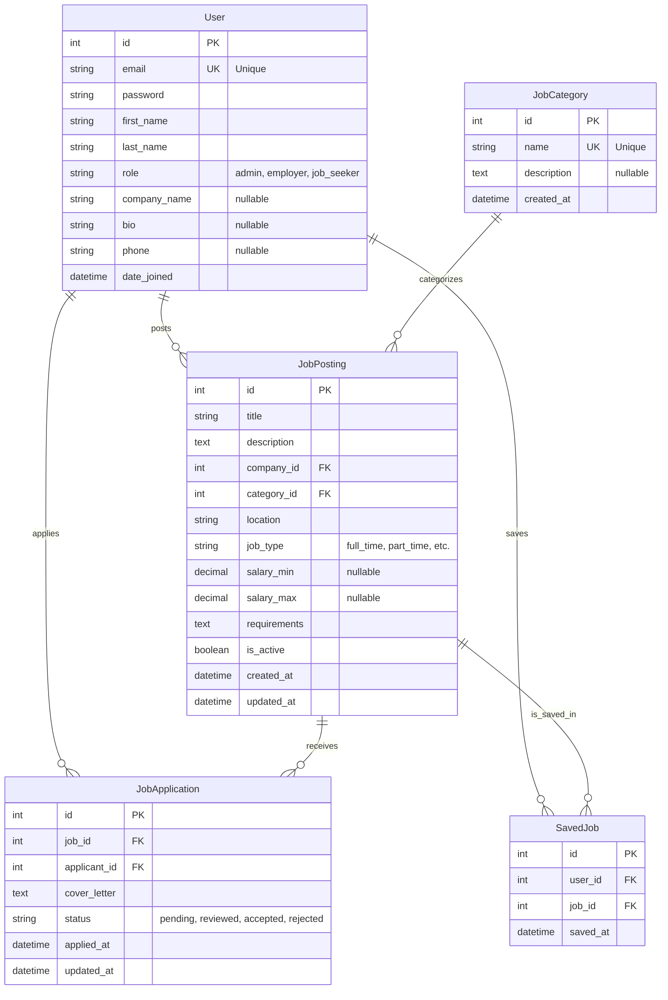

# Job Board Platform - Entity Relationship Diagram

## Relationships

1. **User 1:N JobPosting**
   - An Employer (User) can post multiple Jobs.
   - A Job belongs to one Employer.

2. **JobCategory 1:N JobPosting**
   - A Category can have multiple Jobs.
   - A Job belongs to one Category.

3. **User 1:N JobApplication**
   - A Job Seeker (User) can submit multiple Applications.
   - An Application belongs to one Applicant.

4. **JobPosting 1:N JobApplication**
   - A Job can receive multiple Applications.
   - An Application belongs to one Job.

5. **User 1:N SavedJob** (Many-to-Many via Join Table)
   - A User can save multiple Jobs.
   - A Job can be saved by multiple Users.
